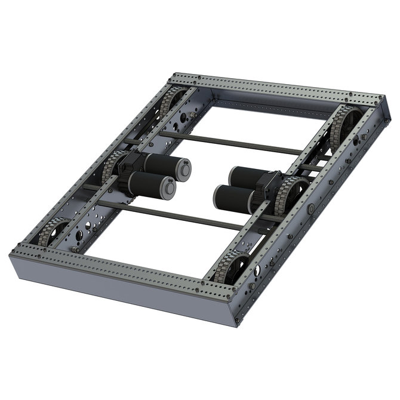
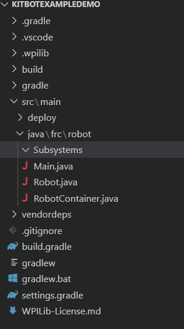
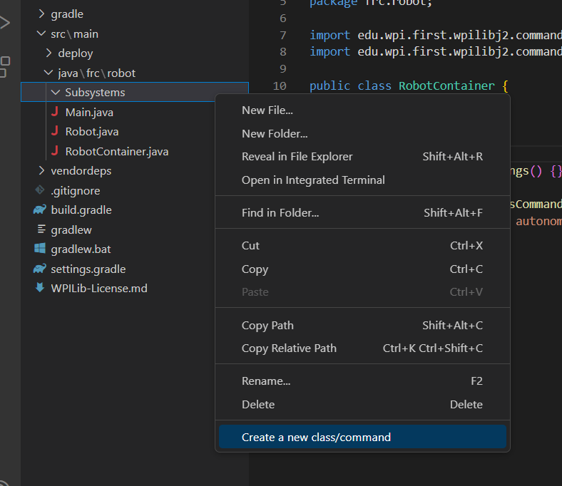
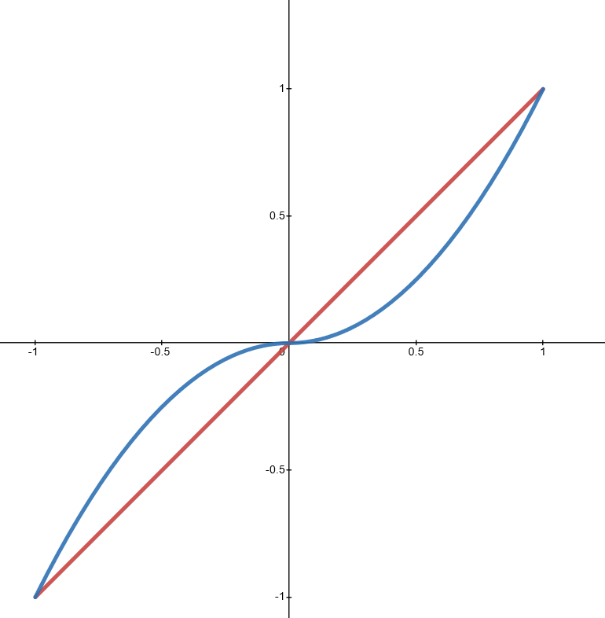
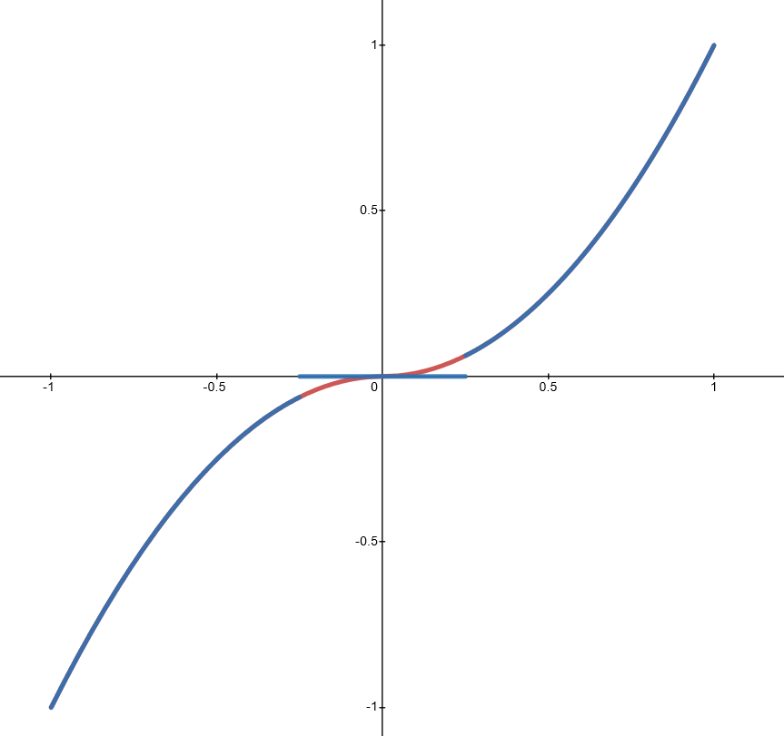

# Kitbot Code Tutorial

## Intro

### What is a kitbot?



The kitbot is a drivetrain which comes in the Kit of Parts provided by FIRST as part of registration.
It is a typical example of a differential drivetrain.
That name comes from the fact that the amount it turns is equal to the difference between the speed of the left and right sides.
This type of drive is also known as skid-steer or tank drive.

### Why kitbot?

We do not use the kitbot or other differential drive for our robots in competition.
Instead, we use a much more versatile swerve drive.
However, the code for a swerve drive is much more complex than a tank drive.
The kitbot has somewhat standard dimensions, gearboxes, wheels, and other physical characteristics, so it makes for a good exercise to introduce you to programming FRC robots.

### So what do we need to program?

Inputs/Outputs:

- A command that takes in velocity and rotational velocity, and outputs the correct wheel speeds to meet that.

Electronics:

- Each side of the chassis has two Neo Sparkmax motors, which will work together to power the left and right sides of the chassis.
  In code this will look like a total of 4 SparkMax motor controllers, which is the component we can talk to.

## Code Walkthrough

If you think you can figure out how to program this on your own, go for it!
However, check your work against this to see if you did it the same way.
If you have any questions about why we did it this way, ask a lead/Mentor.

### Code setup

- Clone the repo given by the lead/mentor. 
- Open up WPILib vscode and open the cloned repo

Once you've opened your project, open the src\main\java\frc\robot folder.



In the subsystems folder, right click and then click "create a new class/command"



Select Subsystem and name it `DrivetrainSubsystem`.
This file is the subsystem file for the kitbot drivetrain.
It will contain all of the hardware that the drivetrain uses, which in this case are Sparkmax motor controllers.
Other subsystems will contain sensors, solenoids, and more.
It will also contain methods that we use to interact with the subsystem from the rest of our code.

Our team names subsystem files using the "NameSubsystem" convention.
That means that our file should end in Subsystem, so it's clear what it is.
The name should also be reasonably short and descriptive.
`IntakeSubsystem` is a good name.
`GreybotsGrabberSubsystem` is too long, and `CircleThingySubsystem` is not specific.

Make sure this class extends `SubsystemBase`.
This is needed to make sure that it is treated as a Subsystem where only one Command can use it at a time.

```Java
public class DrivetrainSubsystem extends SubsystemBase {}
```

In this subsystem file we will need to add our hardware.
But to have access to the API for our motors, we need to install the Rev Robotics Library
Use the instructions [here](https://docs.revrobotics.com/revlib/install) to install the API.
If you want to use your computer to run and setup the robot it is useful to have Rev Hardware Client installed.
The [api docs](https://codedocs.revrobotics.com/java/com/revrobotics/package-summary.html) for Rev Lib are also on the same website.

Once you have installed the vendor library, create four SparkMax objects in your subsystem called `leftLeader`, `leftFollower`,`rightLeader` and `rightFollower`.
By convention, hardware should have a succinct, descriptive name followed by the type of hardware it is.

```Java
import com.revrobotics.spark.SparkLowLevel.MotorType;
 // create brushed motors for drive

public class DrivetrainSubsystem extends SubsystemBase {

private final SparkMax leftLeader;
private final SparkMax leftFollower;
private final SparkMax rightLeader;
private final SparkMax rightFollower;

/** Creates a new Drivetrain. */
public DrivetrainSubsystem() {

}

```

You will notice that red lines will appear under each ```SparkMax``` object define above. That is because that class has to be imported from  the Rev library.At the top of your subsystem file, add ```import com.revrobotics.spark.SparkMax;``` to import the SparkMax class.

 SparkMaxes can be both brushed and brushless. The 
 ```import com.revrobotics.spark.SparkLowLevel.MotorType;``` import brings in pre-defined definitions for brushed and brushless motors that must be passed into the motor constructor.

  The number being passed into the constructor for the SparkMaxs is the ID number of the motor, which we will set later using Rev hardware client.
Since we don't have real hardware for this example this number is arbitrary, but it's good practice to have these sorts of constants defined at the top of the file.Before continuing, please read about constants and how to create the motor ID constants on the [Constants](./Constants.md) page.

After creating the constants, import them using the ```import frc.robot.Constants.DriveConstants;``` syntax.

#### Create Motor Objects

At the top of the constructorm method, create 4 motor objects as shown below.

```Java
public DriveTrainSubsystem {
    leftLeader = new SparkMax(DriveConstants.LEFT_LEADER_ID, MotorType.kBrushed);
    leftFollower = new SparkMax(DriveConstants.LEFT_FOLLOWER_ID, MotorType.kBrushed);
    rightLeader = new SparkMax(DriveConstants.RIGHT_LEADER_ID, MotorType.kBrushed);
    rightFollower = new SparkMax(DriveConstants.RIGHT_FOLLOWER_ID, MotorType.kBrushed);
  
}
```

### Configre Motors

Each SparkMax motor must be configured so that it behaves as expected.

- first each motor will be configured with a CANTimeout. (How long to wait for a response from the motor controller) Add the following lines in the constructor:

  ```Java
  // Set can timeout. Because this project only sets parameters once on
      // construction, the timeout can be long without blocking robot operation. Code
      // which sets or gets parameters during operation may need a shorter timeout.
      leftLeader.setCANTimeout(250);
      rightLeader.setCANTimeout(250);
      leftFollower.setCANTimeout(250);
      rightFollower.setCANTimeout(250);
  ```
- Next Each motor will have to be configured to behave correctly in the drivetrain.

#### Create the DriveTrain

Now that the motors are defined we need to create the differentialdrive object that will actually drive the robot.
Before we create the drivetain, we need to import the DifferentialDrive class from Wpilib, like so: ```import edu.wpi.first.wpilibj.drive.DifferentialDrive;```
at the top of the class, below the four SparkMax variables, add a ```DifferentialDrive``` variable.

```Java
  private final SparkMax leftLeader;
  private final SparkMax leftFollower;
  private final SparkMax rightLeader;
  private final SparkMax rightFollower;

  private final DifferentialDrive drive;
```

```Java
 drive = new DifferentialDrive(leftLeader, rightLeader);
```

Next we will create a motor configuration and set limits on voltage and current. These limits prevent damage and create smoother robot operations.

```Java
// Create the configuration to apply to motors. Voltage compensation
    // helps the robot perform more similarly on different
    // battery voltages (at the cost of a little bit of top speed on a fully charged
    // battery). The current limit helps prevent tripping
    // breakers.
    SparkMaxConfig config = new SparkMaxConfig();
    config.voltageCompensation(12);
    config.smartCurrentLimit(DriveConstants.DRIVE_MOTOR_CURRENT_LIMIT);
```

This is because whenever we want to interact with the hardware of a subsystem we should go through a Command, which guarantees that each piece of hardware is only requested to do one thing at a time.
(If you're feeling unsure about Commands, review the Command Based [article](2.3_CommandBased.md) and/or [presentation](2.4_CommandBasedPresentationNotes.md).)
To do this, we need to make a Command factory method, or a method that returns a `Command`.

```Java
public Command setVoltagesCommand(DoubleSupplier left, DoubleSupplier right) {
  return this.run(() -> this.setVoltages(left.getAsDouble(), right.getAsDouble()));
}
```

Notice how instead of passing in `double`s, we pass in `DoubleSupplier`s.
A `DoubleSupplier` is just any function that returns a `double`.
This function could always return the same value, effectively acting like a double, or it can get its value some other way.
This lets us use this command to drive the robot with joysticks, an autonomous controller, or other input that may change.

In the body of the method we return `this.run()`, which implicitly creates a `RunCommand`.
`RunCommand` is a subtype of Command, and represents a Command which runs a single function over and over again.
This function is defined using lambda syntax, or the `() ->` symbol.
On the right of the arrow is a call to our `setVoltages()` method, which calls our `DoubleSupplier`s which each return a value each call of the function, in this case every 20ms as part of the Command loop.

We might not want to drive the robot just by setting the left and right wheel speeds, however.
Let's add a method that uses a desired forwards/backwards and turning velocity to set the wheel speeds.
We can do this using WPILib's `DifferentialDrive` class.

```Java
public Command setVoltagesArcadeCommand(DoubleSupplier drive, DoubleSupplier steer) {
  return this.run(() -> {
    var speeds = DifferentialDrive.arcadeDriveIK(drive.getAsDouble(), steer.getAsDouble(), false);
    this.setVoltages(speeds.left * 12, speeds.right * 12);
  });
}

```

This method has a very similar structure to the previous method.
The main difference is that instead of having one method in our lambda (`() ->`), we have a code block ({} block).
This means we need to end each line with a ; but can use multiple lines in our Command.

This method is named `setVoltagesArcadeCommand` after the arcade drive control it uses, or one input for driving speed and one for turning speed.
Arcade drive isn't the only option we have for "useful units" for a drivetrain.
Curvature drive is another example which tries to emulate a car by only turning when forward motion is happening.
On a real robot what we use would come down to driver preference.

The "IK" stands for "Inverse Kinematics", a fancy term for a bit of math to convert from the desired driving and turning speed to the needed wheel speeds.
More generally, IK lets us convert from useful units, like an arm's position in space or a drivetrain's speed in each direction, to ones we can directly use, like motor speeds or positions.
In this case, we call `arcadeDriveIK` from WPILib's `DifferentialDrive` class and store the result in a variable called `speeds`.

Then we pass `speeds` to the drive method.
However, there's a catch to these speeds.
Because WPILib's `DifferentialDrive` class doesn't know what kind of motors we run or what voltage our robot is at, it gives us motor speeds in the range -1 to 1, where 1 corresponds to full forward output and -1 corresponds to full reverse output.
We can convert to voltage by multiplying by 12, which our robot should nominally be at.

These methods are all well and good on their own, but it would be nice if we had a way to actually use them.
Let's bind them to a joystick.
Go to `Robot.java`.
Firstly, you can delete `RobotContainer.java` - we'll be handling initialization stuff in `Robot.java` instead.
Add a `CommandXboxController` object.

```Java
// Create a new Xbox controller on port 0
CommandXboxController controller = new CommandXboxController(0);
```

`CommandXboxController` is a convenience wrapper around a `XboxController` that makes it easy to bind commands to buttons on the controller.
We also need to add an instance of the `DrivetrainSubsystem` so that we can control it.

```Java
CommandXboxController controller = new CommandXboxController(0);

DrivetrainSubsystem drivetrainSubsystem = new DrivetrainSubsystem();
```

Finally, we can bind the arcade drive command to the joysticks.
To do this, first define the `Robot()` constructor in `Robot.java`.
Then, call `setDefaultCommand()` on `drivetrainSubsystem` in the constructor.
This sets a Command that will be run when no other command is using the drivetrain.
Pass in `drivetrainSubsystem.setVoltagesArcadeCommand()` as the default Command.

For the `DoubleSupplier`s to the arcade drive command we can add two lambdas that call `getLeftY()` and `getRightX()` on the controller, which looks at the current joystick values.
This means during each loop that this command is run, it will check the current joystick values and turn them into voltages for the wheels.

This line is a little long now, so break it up into a few lines to keep it readable.

```Java
drivetrainSubsystem.setDefaultCommand(
    drivetrainSubsystem.setVoltagesArcadeCommand(
        controller::getLeftY,
        controller::getRightX));
```

Using the joystick values directly is perfectly fine, but sometimes our driver wants a different feel to the controls.
One common way is to square the inputs to the drivetrain, which reduces the sensitivity of the drivebase at low speeds.



The red line here is if we directly take the input, and the blue line shows the squared input.

Another is to add a "deadband" where we wont output any voltage if the input is less than some threshold.
This stops the robot from moving if the controllers are very close to but don't perfectly read 0 when they aren't pressed.



This graph shows an input without a deadband in red, and one with an exaggerated deadband in blue.
Notice how the graphs overlap outside of the deadband.
Also notice the jump in inputs when the deadband stops applying.
For an exaggerated one like this it would be an issue, but for a real input the deadband is usually small enough that this jump is not significant.

Let's add a function to modify the joystick inputs.

Create a function that takes in a double and returns a double called `modifyJoystick`.
Let's start by adding the squaring of the input.
To do this, we multiply our input by itself, but in the process we lose the sign of the input.
We can use `Math.signum` to add it back in.

```Java
private double modifyJoystick(double in) {
    return in * in * Math.signum(in);
}
```

Then let's add the deadband.
If the absolute value of `in` is less than 0.05 (as an example) then return 0.

```Java
private double modifyJoystick(double in) {
    if (Math.abs(in) < 0.05) {
      return 0;
    }
    return in * in * Math.signum(in);
}
```

Now we can add this method into our drive command.

```Java
drivetrainSubsystem.setDefaultCommand(
      drivetrainSubsystem.setVoltagesArcadeCommand(
        () -> modifyJoystick(controller.getLeftY()),
        () -> modifyJoystick(controller.getRightX())));
```

Congratulations!
This code is everything you need for a basic kitbot to drive with arcade controls.
There are plenty of improvements that can be made to this program, such as adding autonomous control or closed loop driving.
Several of those changes you will make to this program over the next couple of courses.
